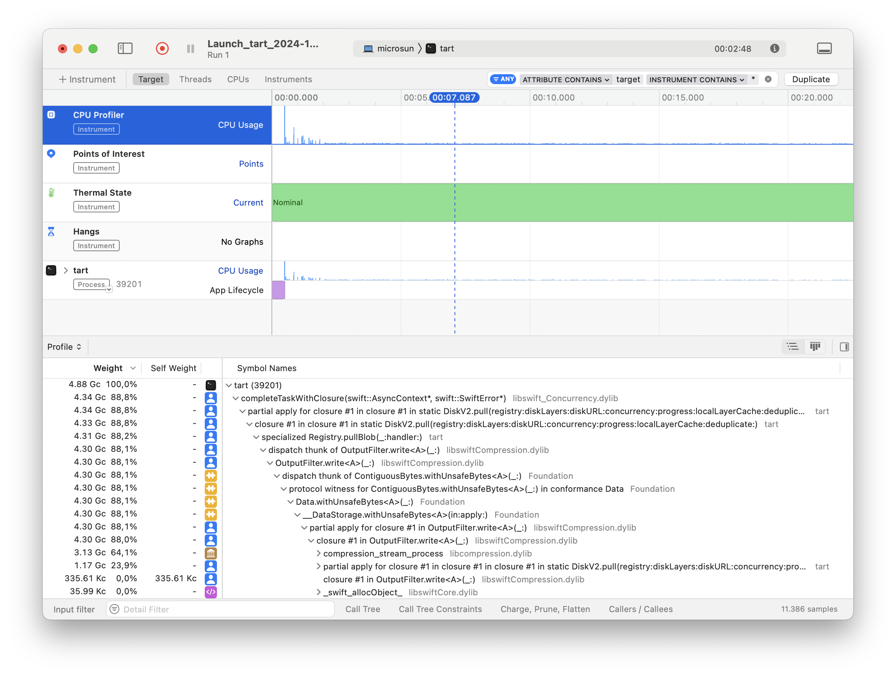

# Profiling Tart

## Using `time(1)`

Perhaps, the easiest, but not the most comprehensive way to tell what's going on with Tart is to use the [`time(1)`](https://ss64.com/mac/time.html) command.

In the example below, you will run `tart pull` via `time(1)` to gather generalized CPU, I/O and memory usage metrics:

```shell
/usr/bin/time -l tart pull ghcr.io/cirruslabs/macos-sequoia-base:latest
```

**Note:** you need to specify a full path to `time(1)` binary, otherwise the shell's built-in `time` command will be invoked, which doesn't have the `-l` command-line argument.

**Note:** The `-l` command-line argument makes `time(1)` return much more useful information, for example, maximum memory usage.

When running the command above, you'll see the `tart pull` output first as it pulls the image, and then the `time(1)` output, which will be printed once the Tart process finishes:

```
      172.17 real        10.29 user         8.36 sys
           353796096  maximum resident set size
                   0  average shared memory size
                   0  average unshared data size
                   0  average unshared stack size
               23838  page reclaims
                  35  page faults
                   0  swaps
                   0  block input operations
                   0  block output operations
                   8  messages sent
                   8  messages received
                   0  signals received
                 146  voluntary context switches
              222950  involuntary context switches
         39683070975  instructions retired
         27562035252  cycles elapsed
           170920448  peak memory footprint
```

From the output above, you can tell that `tart pull` spent nearly 90% of time off-CPU (`real` > `user` + `sys`), which means that Tart was mostly waiting for the I/O (be it a network or disk), instead of decompressing disk layers or doing other useful computations.

## Using `xctrace(1)`

[`xctrace(1)`](https://keith.github.io/xcode-man-pages/xctrace.1.html) is a `.trace` format recorder for the [Instruments](https://en.wikipedia.org/wiki/Instruments_(software)) app, which yields much more powerful insights compared to `time(1)`. For example, it can tell which Tart functions spent the most time on the CPU, thus allowing the Tart developers to further optimize these functions.

To use it, make sure that [Xcode](https://developer.apple.com/xcode/resources/) is installed. If you're installing Xcode for the first time on the machine, you'll need to launch it once and click the blue "Install" button. There's no need to choose any platforms except for the macOS.

Once done, you can create a CPU profile of `tart pull`:

```shell
xctrace record --template "CPU Profiler" --target-stdout - --launch -- /opt/homebrew/bin/tart pull ghcr.io/cirruslabs/macos-sequoia-base:latest
```

Now that `xctrace(1)` is running, you'll see the `tart pull`-related output first, and once finished, the following line will appear:

```
Output file saved as: Launch_[...].trace
```

To view this trace in the Instruments app, simply find this directory in Finder and double-click it. Instruments app will appear:



To send this trace, right-click its directory in Finder and choose "Compress [...]". This will result in a similarly named file with a `.zip` at the end, which can now be conveniently sent via email or uploaded.
