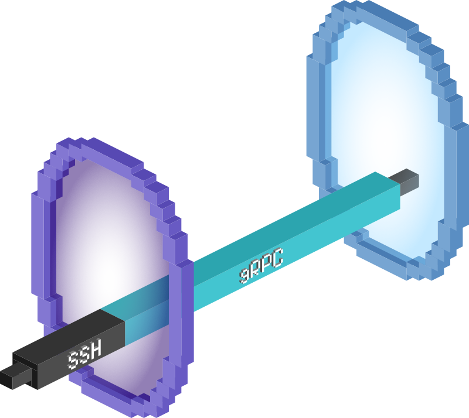

# Jumping through the hoops: SSH jump host functionality in Orchard

Almost a year ago, when we started building [Orchard](https://github.com/cirruslabs/orchard), an orchestration system for Tart, we quickly realized that most worker machines will be in a private network, and that VMs will be only reachable from the worker machines themselves. Thus, one of our goals became to simplify accessing the compute resources in a cluster through a centralized controller host.

This effort resulted in commands like `orchard port-forward` and `orchard ssh`, which were later improved to support connecting not just to the VMs, but to the worker machines themselves.

Today, we’re making an even further step in this effort: with a trivial configuration, an Orchard controller can act as an SSH jump host to allow connecting to the VMs using just the `ssh` command like `ssh -J <service account name>@orchard-controller.example.com <VM name>`!

<!-- more -->

## Implementation

In a typical cluster there’s one controller, to which workers connect by calling various REST API endpoints to synchronize the worker & VMs state. Each worker also maintains a persistent bi-directional gRPC connection with the controller, with the goal of improving the overall reactivity and making the port-forwarding work.

The gRPC service definition that the controller offers is pretty minimalistic:

```protobuf
service Controller {
  rpc Watch(google.protobuf.Empty) returns (stream WatchInstruction);
  rpc PortForward(stream PortForwardData) returns (stream PortForwardData);
}
```

Each watch instruction corresponds a single action to be done by the worker, which can either be a request for establishing a port-forwarding stream or a request for VMs re-syncing:

```protobuf
oneof action {
  PortForward port_forward_action = 1;
  SyncVMs sync_vms_action = 2;
}
```

Now, when the user invokes `orchard port-forward` or `orchard ssh`, controller effectively becomes a rendezvous point by accepting the WebSocket connection from the user, and then asking the worker associated with the requested VM to establish a port-forwarding stream, and finally proxying the two streams together.



SSH protocol works the same way, multiplexing multiple channels in a single transport connection, where each channel can be upgraded either to an interactive session (that’s what you get when you `ssh` to the server) or X11 channel (for X11 forwarding using `-X`), direct or forward TCP/IP channels (these are used for local and remote port-forwarding when using `-L` and `-R` options correspondingly) and so on.

In fact, `ssh -J` jump host functionality also uses the direct TCP/IP channel, which is [just a single port-forwarding request](https://datatracker.ietf.org/doc/html/rfc4254#section-7.2) that needs to be implemented. We’ve used [Golang's SSH library](https://pkg.go.dev/golang.org/x/crypto/ssh) as the most mature choice for this task, and it’s been pleasant to work with so far.

The support for `ssh -J` has landed in Orchard version 0.19.0. To configure the SSH jump host, simply add the `--listen-ssh` command-line argument to your `orchard controller run` invocation.

Once running, you can connect to any VM in the cluster using the `ssh -J <service account name>@orchard-controller.example.com <VM name>`. The password for the jump host is the corresponding service account’s token.

## Future plans

First of all, we’d like to thank our paid clients, without which this feature wouldn’t be possible. [Become one now](../../licensing.md) and get the benefit of higher Tart VMs and Orchard workers allowances and making sure that the roadmap for Tart and Orchard is aligned with your company's needs.

In the near future we plan to implement a mechanism similar to `authorized_keys` file that will allow attaching public SSH keys to the Orchard controller’s service accounts, and thus avoid the need to type the passwords.

Stay tuned and don’t hesitate to send us your feedback on [GitHub](https://github.com/cirruslabs/orchard) and [Twitter](https://x.com/cirrus_labs)!
