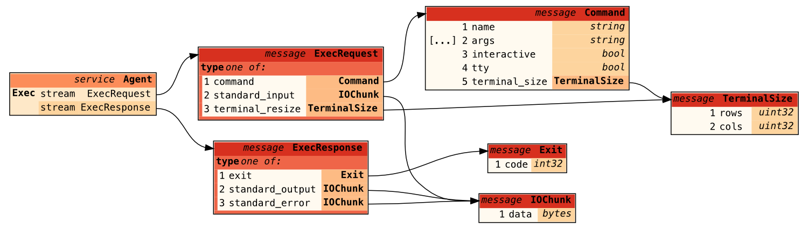

# Bridging the gaps with the Tart Guest Agent

We're introducing a new improvement for the Tart usability experience: a [Tart Guest Agent](https://github.com/cirruslabs/tart-guest-agent).

This agent provides automatic disk resizing, seamless clipboard sharing for macOS guests (a [long-awaited](https://github.com/cirruslabs/tart/issues/14) feature), and the ability to run commands, without SSH and networking, using the new `tart exec` command.

As of recently, we include this agent in all non-vanilla Cirrus Labs images, so you likely won't need to do anything to benefit from these usability improvements.

Read on to learn why we chose to implement the agent from scratch in Golang, and which features we plan to add next.

<!-- more -->

## Existing solutions

Tart uses the Virtualization.Framework, and the latter implemented a SPICE client some time ago, however, one piece was missing: the agent that runs inside the guest.

The original [SPICE `vdagent` implementation](https://gitlab.freedesktop.org/spice/linux/vd_agent) only supports Linux. While [a fork](https://github.com/utmapp/vd_agent) from the UTM project adds macOS support, the long-term viability of maintaining this fork without upstreaming changes is uncertain.

Moreover, if we were to add some extra functionality (as we did), there would be more than one agent binary to ship and install, which complicates maintenance and makes it harder to explain to users why we need a bunch of agent binaries.

In the end, we decided to go with our own solution, one that would easily accomodate future ideas.

## Rolling our own agent

After carefully inspecting the [`vdagent` protocol](https://www.spice-space.org/agent-protocol.html) we've realized that the clipboard sharing is actually a small subset of the whole protocol, making it relatively simple to implement.

Thanks to Golang, we were able to implement the protocol much faster than we could have with a lower-level language like C (with all due respect), which requires manual memory management and complex event loops.

As for the command execution via `tart exec`, we've decided to go with gRPC with a rather simple protocol:

For each `tart exec` invocation a new gRPC `Exec` bidirectional stream is established with the agent running inside a VM. After the gRPC stream is established, `tart exec` sends a command to execute to the guest and streams the I/O. Once the command terminates, `tart exec` collects the process exit code and quits with exactly that exit code.

Using gRPC simplifies `tart exec` implementation because of code generation and forms a nice bridge between the host and the guest which allows us to easily expand the protocol later down the road when we decide to introduce new features.

Thanks to [gRPC Swift](https://github.com/grpc/grpc-swift), which is built on top of [SwiftNIO](https://github.com/apple/swift-nio), we get [`async/await`](https://docs.swift.org/swift-book/documentation/the-swift-programming-language/concurrency/) support for free, further simplifying the `tart exec` logic.

As for the Tart Guest Agent, the final result is a Golang binary that [can be customized](https://github.com/cirruslabs/tart-guest-agent?tab=readme-ov-file#guest-agent-for-tart-vms) depending on the execution context:

* launchd global daemon — runs as a privileged user (`root`), has no clipboard access
    * `--resize-disk` — resizes the disk when there's a free space at the end of a disk (assuming that one previously ran `tart set --disk-size`)
* launchd global agent — runs as a normal user (`admin`), has clipboard access
    * `--run-vdagent` — clipboard sharing
    * `--run-rpc` — `tart exec` and new functionality in the future

We’ve also introduced `--run-daemon` (which implies `--resize-disk`) and `--run-agent` (which implies both `--run-vdagent` and `--run-rpc`) to help run the most appropriate functionality based on the given context.

## Future plans

First, we'd like to thank our paid clients, without whom this feature wouldn't have been possible.

[Become one now](../../licensing.md) and enjoy higher allowances for Tart VMs and Orchard workers—while helping ensure that our roadmap aligns with your company's needs.

In the near future we plan to implement:

* Linux support — to provide seamless experience for Linux guests too
* a new `tart ip` resolver — to provide a more robust IP retrieval facility for Linux guests, which often struggle to populate the host's ARP table with their network activity
* `tart cp` command — to copy files from/to guest VMs

Stay tuned, and feel free to send us feedback on [GitHub](https://github.com/cirruslabs/tart) and [Twitter](https://x.com/cirrus_labs)!
