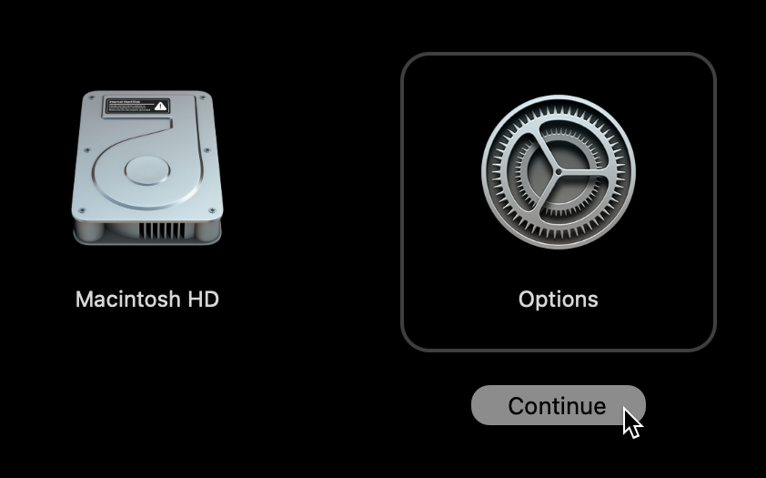
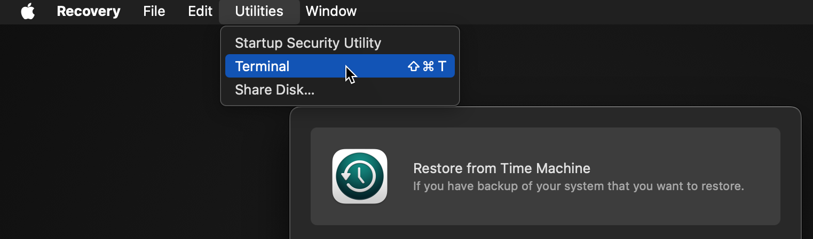

---
hide:
  - navigation
title: Frequently Asked Questions
description: Advanced configuration and troubleshooting tips for advanced configurations.
---

## Troubleshooting crashes

If you experience a crash or encounter another error while using the tart executable, you can collect debug information to assist with troubleshooting. Run the following command in a separate terminal window to gather logs from the Tart process and the macOS Virtualization subsystem:

```shell
log stream --predicate='process=="tart" OR process CONTAINS "Virtualization"' > tart.log
```

While the events are being streamed, attempt to reproduce the issue. Once the issue is reproduced, stop the streaming by pressing Ctrl+C. Then, attach the tart.log file to your report.

## VM location on disk

Tart stores all its files in `~/.tart/` directory. Local images that you can run are stored in `~/.tart/vms/`.
Remote images are pulled into `~/.tart/cache/OCIs/`.

## Nested virtualization support?

Tart is limited by functionality of Apple's `Virtualization.Framework`. At the moment `Virtualization.Framework`
supports nested virtualization only on M3 or M4 chips running macOS 15 (Sequoia). By default, it is disabled, but can be enabled by passing the `--nested` flag to `tart run`.

## Connecting to a service running on host

To connect from within a virtual machine to a service running on the host machine
please first make sure that the service is bound to `0.0.0.0`.

Then from within a virtual machine you can access the service using the router's IP address that you can get either from `Preferences -> Network`
or by running the following command in the Terminal:

```shell
netstat -nr | grep default | head -n 1 | awk '{print $2}'
```

Note: that accessing host is only possible with the default NAT network. If you are running your virtual machines with
[Softnet](https://github.com/cirruslabs/softnet) (via `tart run --net-softnet <VM NAME>)`, then the network isolation
is stricter and it's not possible to access the host.

## Changing the default NAT subnet

To change the default network to `192.168.77.1`:

```shell
sudo defaults write /Library/Preferences/SystemConfiguration/com.apple.vmnet.plist Shared_Net_Address -string 192.168.77.1
```

Note that even through a network would normally be specified as `192.168.77.0`, the [vmnet framework](https://developer.apple.com/documentation/vmnet) seems to treat this as a starting address too and refuses to pick up such network-like values.

The default subnet mask `255.255.255.0` should suffice for most use-cases, however, you can also change it to `255.255.0.0`, for example:

```shell
sudo defaults write /Library/Preferences/SystemConfiguration/com.apple.vmnet.plist Shared_Net_Mask -string 255.255.0.0
```

## Changing the default DHCP lease time

By default, the built-in macOS DHCP server allocates IP-addresses to the VMs for the duration of 86,400 seconds (one day), which may easily cause DHCP exhaustion if you run more than ~253 VMs per day, or in other words, more than one VM every ~6 minutes.

This issue is worked around automatically [when using Softnet](http://github.com/cirruslabs/softnet), however, if you don't use or can't use it, the following command will reduce the lease time from the default 86,400 seconds (one day) to 600 seconds (10 minutes):

```shell
sudo defaults write /Library/Preferences/SystemConfiguration/com.apple.InternetSharing.default.plist bootpd -dict DHCPLeaseTimeSecs -int 600
```

This tweak persists across reboots, so normally you'll only need to do it once per new host.

If that doesn't help after starting a new VM, it's possible that the `/var/db/dhcpd_leases` file is already overfilled with 86,400-second leases. You can remove it with the following command and try starting a new VM again:

```shell
sudo rm /var/db/dhcpd_leases
```

And no worries, this file will be re-created on the next `tart run`.

## Unsupported DHCP client identifiers

Due to the limitations of the macOS built-in DHCP server, `tart ip` is unable to correctly report the IP addresses for VMs using DHCP client identifiers that are not based on VMs link-layer addresses (MAC addresses).

By default, when [no `--resolver=arp` is specified](#resolving-the-vms-ip-when-using-bridged-networking), `tart ip` reads the `/var/db/dhcpd_leases` file and tries to find the freshest entry that matches the VM's MAC address (based on the `hw_address` field).

However, things starts to break when the VM uses a [DUID-EN](https://metebalci.com/blog/a-note-on-dhcpv6-duid-and-prefix-delegation#duid-types) identifier, for example. One of the notorious examples of this being Ubuntu, using this type of identifier by default on latest versions.  This results in the `/var/db/dhcpd_leases` entry for Ubuntu appearing as follows:

```ini
{
    name=ubuntu
    ip_address=192.168.64.3
    hw_address=ff,f1:f5:dd:7f:0:2:0:0:ab:11:cb:fb:30:b0:97:b6:3a:67
    identifier=ff,f1:f5:dd:7f:0:2:0:0:ab:11:cb:fb:30:b0:97:b6:3a:67
    lease=0x678e2ce7
}
```

Because the macOS built-in DHCP server overwrites the `hw_address` with the `identifier`, it leaves no information about the VM's MAC address to the `tart ip`.

To avoid this issue, make sure that your VM only sends a DHCP client identifier (option 61) with link-layer address (MAC address) or that it doesn't send this option at all.

For the aforementioned Ubuntu, the solution is outlined in the section [How to integrate with Windows DHCP Server](https://netplan.readthedocs.io/en/stable/examples/#how-to-integrate-with-windows-dhcp-server) of Canonical Netplan's documentation:

```yaml
network:
  version: 2
  ethernets:
    enp3s0:
      dhcp4: yes
      dhcp-identifier: mac
```

## Resolving the VM's IP when using bridged networking

When running `tart run` with `--net-bridged`, you need to invoke `tart ip` differently, because the macOS built-in DHCP server won't have any information about the VM's IP-address:

```shell
tart ip --resolver=arp <VM>
```

This causes the `tart ip` to consult the host's ARP table instead of the `/var/db/dhcpd_leases` file.

Note that this method of resolving the IP heavily relies on the level of VM's activity on the network, namely, exchanging ARP requests between the guest and the host.

This is normally not an issue for macOS VMs, but on Linux VMs you might need to install Samba, which includes a [NetBIOS name server](https://www.samba.org/samba/docs/current/man-html/nmbd.8.html) and exhibits the same behavior as macOS, resulting in the population of the ARP table of the host OS:

```shell
sudo apt-get install samba
```

## Running login/clone/pull/push commands over SSH

When invoking the Tart in an SSH session, you might get error like this:

>Keychain returned unsuccessful status -25308

...or this:

>Keychain failed to update item: User interaction is not allowed.

This is because Tart uses [Keychain](https://en.wikipedia.org/wiki/Keychain_(software)) to store and retrieve OCI registry credentials by default, but Keychain is only automatically/semi-automatically unlocked in GUI sessions.

To unlock the Keychain in an SSH session, run the following command, which will ask for your user's password:

```shell
security unlock-keychain
```

This command also supports the `-p` command-line argument that allows you to supply the password and unlock non-interactively, which is great for scripts.

If that doesn't work for you for some reason, you can pass the credentials via the environment variables, see [Registry Authorization](integrations/vm-management.md#registry-authorization) for more details on how to do that.

## How Tart is different from Anka?

Under the hood Tart is using the same technology as Anka 3.0 so there should be no real difference in performance
or features supported. If there is some feature missing please don't hesitate to [create a feature request](https://github.com/cirruslabs/tart/issues).

Instead of Anka Registry, Tart can work with any OCI-compatible container registry. This provides a much more consistent
and scalable experience for distributing virtual machines.

Tart does have an analogue of Anka Controller for managing VMs across a cluster of Mac hosts called [Orchard](orchard/quick-start.md).

## Automatic pruning

`tart pull` and `tart clone` commands check the remaining space available on the volume associated with `TART_HOME` directory (defaults to `~/.tart`) before pulling or cloning anything.

In case there's not enough space to fit the newly pulled or cloned VM image, Tart will remove the least recently accessed VMs from OCI cache and `.ipsw` files from IPSW cache until enough free space is available.

To disable this functionality, set the `TART_NO_AUTO_PRUNE` environment variable either globally:

```shell
export TART_NO_AUTO_PRUNE=
```

...or per `tart pull` and `tart clone` invocation as follows:

```shell
TART_NO_AUTO_PRUNE= tart pull ...
```

## Disk resizing

Disk resizing works on most cloud-ready Linux distributions out-of-the box (e.g. Ubuntu Cloud Images have the `cloud-initramfs-growroot` package installed that runs on boot) and on the rest of the distributions by running the `growpart` or `resize2fs` commands.

For macOS, however, things are a bit more complicated, and you generally have two options: automated and manual resizing.

For the automated option, you can use [Packer](https://www.packer.io/) with the [Packer builder for Tart VMs](https://developer.hashicorp.com/packer/integrations/cirruslabs/tart/latest/components/builder/tart). The latter has two has configuration directives related to the disk resizing behavior:

* [`disk_size_gb`](https://developer.hashicorp.com/packer/integrations/cirruslabs/tart/latest/components/builder/tart#configuration-reference) — controls the target disk size in gigabytes
* [`recovery_partition`](https://developer.hashicorp.com/packer/integrations/cirruslabs/tart/latest/components/builder/tart#configuration-reference) — controls what to do with the recovery partition when resizing the disk
    * you can either keep, delete or relocate it to the end of the disk

For the manual approach, you have to remove the recovery partition first, repair the disk and the resize the APFS container.

To do this, first we'll need to identify the primary disk and the APFS containers by running the command below from within a VM:

```shell
diskutil list physical
```

For example, the output might look like this:

```plain
/dev/disk0 (internal, physical):
   #:                       TYPE NAME                    SIZE       IDENTIFIER
   0:      GUID_partition_scheme                        *100.0 GB   disk0
   1:             Apple_APFS_ISC Container disk1         524.3 MB   disk0s1
   2:                 Apple_APFS Container disk3         44.1 GB    disk0s2
   3:        Apple_APFS_Recovery Container disk2         5.4 GB     disk0s3
                    (free space)                         50.0 GB    -
```

In the output, you'll normally see:

* a single physical disk (`disk0`)
* APFS container with the system partition which we're going to resize (`disk0s2`)
* APFS container with the recovery partition which we're going to delete (`disk0s3`)
* `(free space)` which we'll put to use

To proceed, boot the VM in recovery mode using `tart run --recovery` and choose the "Options" item:

{width="640" .center}

When the recovery OS boots, open the Terminal app:

{width="720" .center}

In Terminal app, invoke the command below to remove the recovery partition:

```shell
diskutil eraseVolume free free disk0s3
```

Now, repair the disk:

```shell
yes | diskutil repairDisk disk0
```

Finally, resize the system APFS container to take all the remaining space:

```shell
diskutil apfs resizeContainer disk0s2 0
```

Now, you can shut down and `tart run` as you'd normally do.
